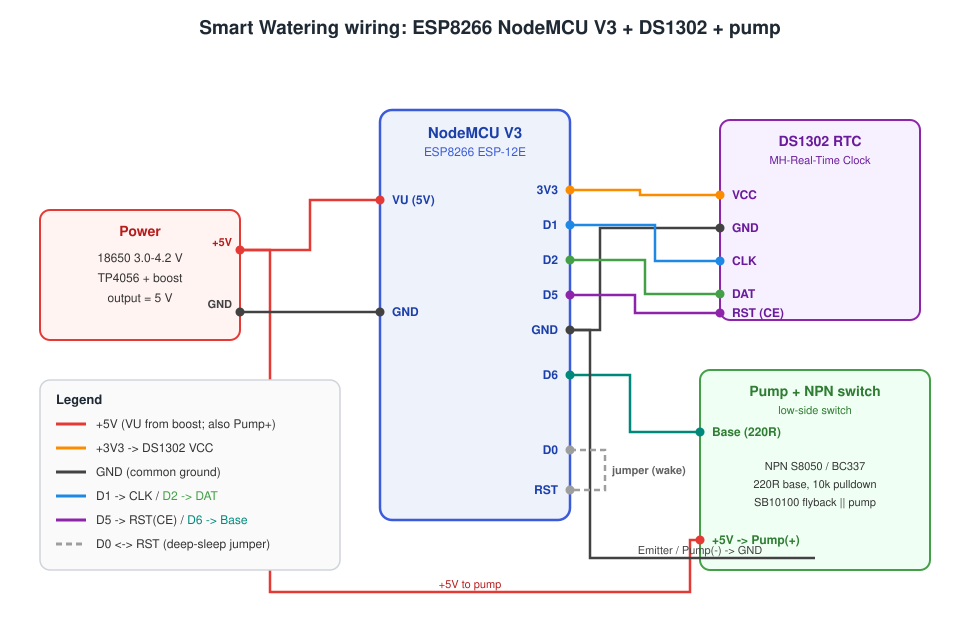
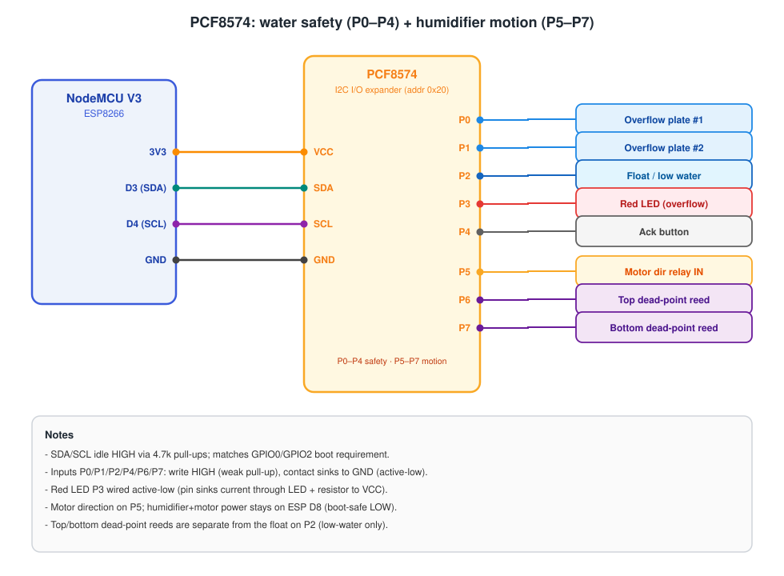
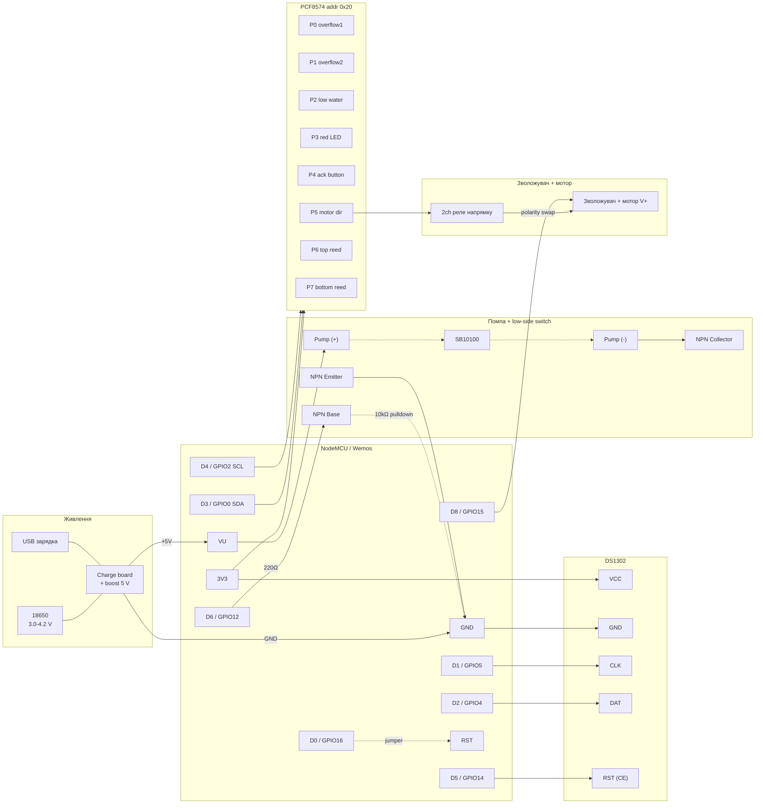

# Smart Watering — повна інструкція

Розумна система автополиву на базі ESP8266 (LoLin NodeMCU V3) з веб-кабінетом
на Next.js. Прошивка прокидається з deep sleep, локально вирішує що поливати
(catch-up для пропущених поливів), синхронізує конфіг через JWT-API.

## Що в репо

- **`web-app/`** — Next.js 15 + Prisma + Postgres + Clerk + TailwindCSS/shadcn.
- **`firmware/`** — PlatformIO-проєкт для ESP8266 (board `nodemcuv2`, який
  електрично сумісний з V3 LoLin клонами).

## Архітектура (коротко)

- Користувачі автентифікуються через Clerk.
- Пристрої автентифікуються власною парою `username/password` (можна шарити
  на групу пристроїв). Логін → access JWT (15 хв) + refresh-token (60 днів,
  ротація при кожному рефреші).
- Пристрої прив'язуються до користувача парою `DEVICE_ID` + `CLAIM_CODE`,
  які зашиті у прошивці ще на етапі provisioning.
- Розклад: до 5 записів `(timeLocal HH:MM, durationSeconds 1..600)` на
  пристрій. Час зберігається у локальному часі таймзони пристрою.
- Catch-up rule: для кожного розкладу — максимум один запуск на календарний
  день у TZ пристрою. Якщо пристрій був офлайн у запланований час — поллє
  при наступному пробудженні. 6-годинний circuit-breaker гарантує, що на
  стику днів (23:59 → 00:01) не буде подвійного поливу.
- Watering log: подія зберігається у БД після успішного `/sync`, до того
  тримається на пристрої у `/pending.json`.

Повну специфікацію див. у
[`.cursor/plans/smart-watering-monorepo_15eea35e.plan.md`](.cursor/plans/smart-watering-monorepo_15eea35e.plan.md).

## Залізо: схема підключення

### Список компонентів

| #  | Компонент                              | К-сть | Примітки                                       |
| -- | -------------------------------------- | ----- | ---------------------------------------------- |
| 1  | LoLin NodeMCU V3 (ESP8266 ESP-12E)     | 1     | CH340 USB-чіп                                  |
| 2  | DS1302 RTC модуль (MH-Real-Time Clock Module-2) | 1 | 3-дротовий (CLK/DAT/RST), живлення 3.3В   |
| 3  | Помпа 5V мембранна (R385 або аналог)   | 1     | ~80–120 мА робочий струм                       |
| 4  | NPN-транзистор (low-side ключ)         | 1     | S8050 (1.5 А) або BC337 (800 мА)               |
| 5  | Резистор 220 Ω                         | 1     | базовий резистор (D6 → база)                   |
| 6  | Резистор 10 кΩ                         | 1     | базовий pulldown (база → GND)                  |
| 7  | Діод Шотткі SB10100 (або 1N4007/SS34)  | 1     | flyback-захист помпи                           |
| 8  | Li-ion 18650 + holder                  | 1     | 3.0–4.2 В                                      |
| 9  | Плата заряду + boost до 5В             | 1     | TP4056 + SX1308 / готовий PowerBoost           |
| 10 | Дрот / перемичка                       | 1     | D0 ↔ RST для wake-from-sleep                   |
| 11 | Датчик переливу/протікання (2 пластини з доріжками) | 2 | саморобний; вода замикає доріжки → GND (на PCF) |
| 11a| Резистор 4.7 кΩ (I²C pull-up)           | 2     | SDA і SCL → 3V3 (якщо модуль PCF без своїх)    |
| 12 | Поплавок з магнітом + гіркон (reed)    | 1     | зовні ємності; low water на PCF P2             |
| 13 | Світлодіод червоний + резистор 330 Ω   | 1     | індикатор переливу (PCF P3, active-low)        |
| 14 | Кнопка (momentary)                     | 1     | підтвердження/скидання тривоги (PCF P4)        |
| 15 | Зволожувач + ключ (MOSFET/реле)        | 1     | напр. AO3400/IRLZ44N; вихід D8/GPIO15          |
| 16 | Мотор руху зволожувача                 | 1     | живиться разом зі зволожувачем від D8          |
| 17 | Реле 2-канальне (5В модуль)            | 1     | реверс полярності мотора; IN від PCF P5        |
| 18 | Гіркони мертвих точок (reed)           | 2     | верх (P6) і низ (P7) руху зволожувача          |
| 19 | PCF8574 I2C-розширювач I/O             | 1     | **обов’язковий**; addr 0x20 (A0..A2 → GND)     |

### Pin-mapping NodeMCU V3

| Пін NodeMCU      | GPIO    | Призначення                              |
| ---------------- | ------- | ---------------------------------------- |
| **VU** (або Vin) | —       | +5В вхід від плати заряду                |
| **GND**          | —       | Спільна земля (всі модулі)               |
| **3V3**          | —       | +3.3В для DS1302 + PCF8574               |
| **D1**           | GPIO5   | DS1302 **CLK** (SCLK)                     |
| **D2**           | GPIO4   | DS1302 **DAT** (I/O)                      |
| **D5**           | GPIO14  | DS1302 **RST** (Chip Enable)             |
| **D6**           | GPIO12  | Керування транзистором помпи (база через 220 Ω) |
| **D0**           | GPIO16  | ↔ **RST** плати (jumper для wake-from-sleep) |
| **D8**           | GPIO15  | Зволожувач + мотор (через MOSFET/реле; LOW на старті) |
| **D3**           | GPIO0   | I²C **SDA** → PCF8574 (idle HIGH, boot-safe) |
| **D4**           | GPIO2   | I²C **SCL** → PCF8574 (idle HIGH, boot-safe) |
| **TX** / **RX**  | GPIO1/3 | Serial (повний UART)                     |
| **A0**           | ADC0    | вільний (напр. під вимірювання батареї)  |

### Pin-mapping PCF8574 (addr 0x20)

| Пін PCF | Група | Призначення |
| ------- | ----- | ----------- |
| **P0** | water safety | Датчик переливу №1 (active-low → GND) |
| **P1** | water safety | Датчик переливу №2 (active-low → GND) |
| **P2** | water safety | Поплавок / low water (reed) |
| **P3** | water safety | Червоний LED (active-low) |
| **P4** | water safety | Кнопка ack |
| **P5** | humidifier motion | Реле напрямку мотора (IN1+IN2) |
| **P6** | humidifier motion | Гіркон верхньої мертвої точки |
| **P7** | humidifier motion | Гіркон нижньої мертвої точки |

**PCF8574 обов’язковий** — без нього прошивка не керує датчиками / LED / кнопкою /
рухом зволожувача. На ESP лишаються лише: I²C, RTC (D1/D2/D5 разом), помпа (D6),
живлення зволожувача (D8 — boot-safe LOW; PCF після живлення тягне піни HIGH),
wake (D0↔RST).

### Малюнок підключення



Кольори дротів: 🔴 +5V · 🟠 +3V3 · ⚫ GND · 🔵 D1→CLK · 🟢 D2→DAT · 🟣 D5→RST(CE) · 🟦 D6→база (NPN) · 🟤 D3/D4→I²C · ⚪ перемичка D0↔RST.

Підсистема безпеки + рух зволожувача на PCF8574:



### Логічна схема



### Помпа + NPN-ключ (детальніше)

```
   +5V (VU)
      │
      ├─────────────►   Pump (+) ◄── катод SB10100
      │                                  │
      │                                  ▼
      │                 Pump (-) ◄── анод SB10100
      │                     │            (flyback: під час "штатної"
      │                     ▼             роботи діод reverse-biased,
      │               NPN Collector       провідить лише викид, коли
      │                     │              транзистор закривається)
      │                  ┌──┴──┐
      │            Base  │ NPN │  S8050 / BC337 (low-side)
      │         ◄── 220Ω ┤     │
      │            │     └──┬──┘
      │            ▼        │ Emitter
      │  D6 (GPIO12)        ▼
      │   база→10kΩ→GND    GND
      └────────────────────►GND
```

> Логіка прошивки незмінна: `D6 = HIGH` → транзистор відкритий → помпа працює.
> Якщо помпа сильніша (~0.3–0.5 А), зроби **дарлінгтон**: D6 → 220 Ω → база BC337,
> емітер BC337 → база S8050, обидва колектори → Pump(−), емітер S8050 → GND.

### Критичні нюанси

- **Jumper D0 ↔ RST.** Без нього ESP не прокинеться з deep sleep. Якщо хочете і далі прошивати плату через USB після розводки — замість прямої перемички поставте **Schottky-діод (катод/смужка → D0, анод → RST)** або резистор **1 кΩ** між D0 і RST. Так GPIO16 усе ще притягує RST до низького рівня для wake, але DTR-reset з UART «перемагає» під час прошивки. (Полярність важлива: катод саме на боці D0/GPIO16.)
- **Не плутайте два «RST».** Пін `RST` на модулі DS1302 — це Chip Enable самого годинника, він іде на **D5 (GPIO14)**. Пін `RST` на NodeMCU — це reset мікроконтролера, він з'єднується перемичкою з **D0**. Це різні речі.
- **Базовий резистор 220 Ω.** Обмежує струм бази з GPIO: Ib ≈ (3.3 − 0.7) / 220 ≈ 12 мА — достатньо для насичення транзистора на струмі помпи ~100 мА і безпечно для піна ESP.
- **Pulldown 10 кΩ на базі.** Перші ~50 мс після power-on GPIO12 у high-impedance — транзистор може відкритись від наводки. Pulldown тримає базу низькою, поки прошивка не виставить пін явно.
- **Flyback-діод SB10100.** Помпа — індуктивне навантаження. Без діода транзистор ризикує пробитись від reverse-EMF при вимиканні. Катод (смужка) → +5V (Pump+), анод → колектор-сторона (Pump–). Підійде і 1N4007/SS34.
- **Чому BJT, а не TO-220 MOSFET.** Помпа дрібна (~100 мА), тож NPN-ключ простіший і відкривається напряму від 3.3 В. **IRF3205/IRF9530N не годяться**: вони не logic-level (треба ~10 В на gate), а IRF9530 ще й P-канальний. Якщо все ж хочеш MOSFET — бери logic-level (AO3400, IRLZ44N, 2N7000, Vgs(th) ≤ 2.5 В).
- **⚠️ GPIO0/GPIO2 = I²C (boot-safe).** D3/D4 — SDA/SCL до PCF8574. Обидва піни
  idle HIGH (зовнішні pull-up 4.7 кΩ до 3V3), тож boot-mode ESP8266 не ламається.
  Датчики переливу сидять на P0/P1 розширювача — мокрі пластини під час reset
  більше не заводять ESP у flash-mode.
- **Спільна земля.** GND плати заряду, GND NodeMCU, GND PCF, емітер транзистора —
  все на одну точку.
- **Антишум 0.1 µF (104).** Керамічний конденсатор паралельно клемам помпи гасить іскри щіток мотора.
- **A0 вільний.** Усі дискретні входи на PCF; A0 можна пізніше використати під
  вимірювання батареї.
- **Ключ зволожувача на D8.** `GPIO15` апаратно LOW на boot — безпечно для
  active-high MOSFET/реле. Не переносьте живлення навантаження на PCF: після
  подачі живлення піни PCF слабо підтягнуті HIGH. Для індуктивного навантаження
  (реле) — flyback-діод; для 5–12 В — logic-level MOSFET (AO3400/IRLZ44N).

### Тривоги: перелив та низький рівень води

Пристрій відстежує дві аварійні ситуації і рапортує їх на сервер під час
`/sync` (поле `alerts`). Плашки на сайті — це похідна від таблиці `DeviceAlert`,
рядки якої **ніколи не видаляються** (лишаються в історії для аналізу).

**Перелив / протікання (червоний LED).** Два саморобні датчики-пластини. Якщо
будь-який замкнувся:

1. помпа **і зволожувач миттєво зупиняються** (перевірка йде і перед запуском, і
   в циклі `pump::run` / `humidifier::run` під час роботи);
2. на сервер летить `overflow.active=true` зі списком датчиків, що спрацювали →
   на дашборді з'являється червона плашка (видно, який саме датчик);
3. пристрій **не засинає** і **безперервно блимає червоним** світлодіодом,
   доки користувач не натисне кнопку на пристрої;
4. після натискання пристрій шле `ackOverflow=true` → червона плашка зникає
   (рядок лишається в історії зі статусом «Підтверджено»), і лише тоді пристрій
   іде у deep sleep.

**Низький рівень води (тільки веб-інтерфейс).** Поплавок із магнітом
опускається до дна й замикає гіркон зовні ємності:

1. полив і зволоження пропускаються (не качаємо порожнечу);
2. на сервер летить `lowWater.active=true` → синя плашка «Низький рівень води»
   на дашборді;
3. коли воду долили і гіркон розімкнувся, при наступному `/sync` летить
   `lowWater.active=false` → плашка зникає (рядок лишається в історії зі статусом
   «Вирішено»).

Якщо `/sync` не вдався (немає Wi-Fi/авторизації) — знімок тривоги зберігається у
`/alerts.json` на LittleFS і повторно рапортується при наступному пробудженні.

### Зволожувач (окремий розклад)

Зволожувач має **власний розклад**, окремий від поливу (у БД — `Schedule.type =
"humidifier"`). На сторінці пристрою є два редактори: «Розклад поливу» і
«Розклад зволоження» (до 5 записів кожен; тривалість зволоження — до 1800 с).

- Диспетчер `runDueSchedules` за `type` запускає або `pump::run` (полив), або
  `humidifier::run` (зволоження) на `D8/GPIO15` через ключ.
- Під час зволоження **плата не спить** — це блокуючий цикл, поки пристрій
  активний; після завершення повертається у звичайний цикл і deep sleep.
- Зволоження пропускається при активній тривозі переливу або низького рівня
  води; при спрацюванні датчика переливу зволоження обривається миттєво.
- Кожен запуск логуються у `WateringEvent` з `type` ("watering"/"humidifier")
  і показується в історії «Останні поливи та зволоження».

> Увага щодо батареї: довге зволоження тримає ESP увімкненим увесь час, тож
> закладайте це у розрахунок споживання (або живіть від мережі).

### Рух зволожувача (мотор + реле)

Зволожувач рухається вгору-вниз маленьким мотором, який живиться від тієї ж
лінії D8 що й сам зволожувач. Напрямок обертання визначається **2-канальним
реле**, яке перемикає полярність мотора (DPDT-ефект). Реле керується з
**PCF P5** (`sensors::setMotorDirection`).

У мертвих точках стоять **два окремі гіркони** на PCF: верх (P6) і низ (P7).
Поплавок низького рівня води — окремо на P2 і **не** бере участі в реверсі.
Під час `humidifier::run()` прошивка опитує геркони кожні 50 мс:

- bottom reed (P7) спрацював → мотор вгору (`setMotorDirection(true)`)
- top reed (P6) спрацював → мотор вниз (`setMotorDirection(false)`)

На старті `run()` / `begin()` читаються поточні геркони (холодний старт після
втрати живлення): якщо вже на верху — DOWN, якщо внизу — UP, інакше дефолт
DOWN до першої мертвої точки. Напрямок далі тримається в `static bool`.

```
  D8 (GPIO15, MOSFET) ──── V+ ──┬── Зволожувач
                                 │
                                 └── 2-ch Relay COM1 / COM2

  PCF P5 ──── IN1 + IN2 (з'єднані)

  Relay OFF: Motor(+) = V+, Motor(-) = GND  → DOWN
  Relay ON:  Motor(+) = GND, Motor(-) = V+  → UP

  PCF P6 ← top dead-point reed → GND
  PCF P7 ← bottom dead-point reed → GND
  PCF P2 ← float / low-water reed → GND   (окремо від руху)
```

## 1. Налаштування web-app

```bash
pnpm install
cp web-app/.env.example web-app/.env
# заповнити DATABASE_URL, DEVICE_JWT_SECRET (>= 32 символи)
# опційно: AUTH_MODE=local (без Clerk) або CLERK_* keys

pnpm db:migrate     # створити таблиці у Postgres
pnpm dev            # http://localhost:3000
```

`DEVICE_JWT_SECRET` згенеруйте через `openssl rand -hex 32`.

### Auth mode

Веб-кабінет може працювати у двох режимах:

| AUTH_MODE        | Опис                                                                                                       |
| ---------------- | ---------------------------------------------------------------------------------------------------------- |
| `local`          | Без зовнішнього сервісу. Кожен відвідувач — це один single-user (`local-user`). Працює офлайн, без ключів. |
| `clerk` (default) | Багатокористувацький auth через [Clerk](https://clerk.com). Потребує `pk_test_…` + `sk_test_…` і онлайн.   |

Для локальної розробки чи self-hosted single-user інсталяції простіше:

```env
AUTH_MODE=local
```

UI у цьому режимі: `/sign-in` та `/sign-up` редіректять на `/dashboard`,
у хедері замість `<UserButton/>` бейдж «Local mode». Усі дашборд-сторінки
й API працюють, дані пристроїв прив'язуються до фіксованого `local-user`.

Для Vercel-деплою / production з кількома користувачами — використайте
`AUTH_MODE=clerk` (або просто видаліть `AUTH_MODE`) і налаштуйте Clerk
як описано у розділі 5.

## 2. Provisioning нового пристрою

```bash
pnpm provision-device \
  --id=ESP_BEDROOM_FLOWERS_01 \
  --username=batch-2026-05 \
  --tz=Europe/Kyiv \
  [--password='<secret>'] \
  [--claim-code=A1B2C3] \
  [--name='Фікус'] \
  [--server=https://your-app.vercel.app]
```

Якщо `--password` чи `--claim-code` не задані — згенерує криптостійкі.
Виведе на stdout готовий `config.h` snippet:

```cpp
#define WIFI_SSID    "<your-wifi-ssid>"
#define WIFI_PASS    "<your-wifi-pass>"
#define DEVICE_ID    "ESP_BEDROOM_FLOWERS_01"
#define DEVICE_USER  "batch-2026-05"
#define DEVICE_PASS  "<згенерований>"
#define CLAIM_CODE   "A1B2C3"
#define SERVER_URL   "https://your-app.vercel.app"
```

Збережіть `CLAIM_CODE` — його треба буде ввести у UI при прив'язці. Один
`username` можна перевикористати для кількох `DEVICE_ID` — пароль зберігається
лише при першому виклику; для наступних пристроїв скрипт перевикористає
існуючий credential.

## 3. Прошивка ESP

```bash
cd firmware
cp include/config.h.example include/config.h
# вставити вивід з provision-device + WIFI_SSID/WIFI_PASS

pio run -t upload
pio device monitor
```

При першому запуску у Serial-моніторі побачите щось на кшталт:

```
==== Smart Watering boot ====
Device: ESP_BEDROOM_FLOWERS_01
[net] connecting to MyWiFi.... OK (192.168.1.42)
[net] POST .../api/device/login -> 200 (...)
[net] POST .../api/device/sync -> 200 (...)
[main] claimed=0 configChanged=0 nextWake=1800 s
[main] deep sleeping for 1800 s
```

Поки пристрій не прив'язаний, `claimed=0` — це нормально.

## 4. Прив'язка у UI

1. Відкрити http://localhost:3000 (чи деплой) → увійти/створити акаунт.
2. Натиснути `+ Додати пристрій`.
3. Ввести `DEVICE_ID` + `CLAIM_CODE` + назву + таймзону → `Прив'язати`.
4. На сторінці пристрою додати до 5 розкладів (час + тривалість у секундах) →
   `Зберегти`.

Пристрій підхопить новий розклад при наступному пробудженні (макс. через
30 хвилин за замовчуванням; інтервал контролюється сервером через
`nextWakeSeconds` у відповіді `/sync`).

## 5. Деплой на Vercel

### 5.1. Створити Postgres БД

У Vercel дашборді → **Storage** → **Create Database** → **Postgres** (під
капотом Neon). Регіон: найближчий (для Києва — Frankfurt).

Vercel згенерує три URL:

- `POSTGRES_PRISMA_URL` — pooled, для рантайму.
- `POSTGRES_URL_NON_POOLING` — direct, для міграцій.
- `POSTGRES_URL` — pooled без додаткових параметрів.

Маппінг для Prisma:

| Наш env       | Vercel Postgres        |
| ------------- | ---------------------- |
| `DATABASE_URL` | `POSTGRES_PRISMA_URL`     |
| `DIRECT_URL`   | `POSTGRES_URL_NON_POOLING` |

### 5.2. Налаштувати Clerk

На [clerk.com](https://clerk.com) → нова Application → у **API Keys** взяти:

- `NEXT_PUBLIC_CLERK_PUBLISHABLE_KEY` (`pk_test_…` / `pk_live_…`)
- `CLERK_SECRET_KEY` (`sk_…`)

### 5.3. Згенерувати JWT-секрет для пристроїв

```bash
openssl rand -hex 32
```

### 5.4. Запушити репо на GitHub

```bash
git add .
git commit -m "Initial smart-watering monorepo"
git remote add origin git@github.com:<you>/<repo>.git
git push -u origin main
```

### 5.5. Імпортувати у Vercel

Vercel → **Add New → Project** → обрати GitHub repo. **Найважливіше:**

| Поле                | Значення                                                      |
| ------------------- | ------------------------------------------------------------- |
| Framework Preset    | Next.js (детектується)                                        |
| **Root Directory**  | **`web-app`** ← обов'язково змінити з кореня                 |
| Build Command       | дефолт (`next build`) — `package.json` уже робить `prisma generate` |
| Install Command     | дефолт (`pnpm install`)                                       |
| Output Directory    | дефолт                                                        |

### 5.6. Environment Variables

У розділі **Environment Variables** (Production + Preview + Development):

```
DATABASE_URL                                    = <POSTGRES_PRISMA_URL>
DIRECT_URL                                      = <POSTGRES_URL_NON_POOLING>
DEVICE_JWT_SECRET                               = <openssl rand -hex 32>
NEXT_PUBLIC_CLERK_PUBLISHABLE_KEY               = pk_test_...
CLERK_SECRET_KEY                                = sk_test_...
NEXT_PUBLIC_CLERK_SIGN_IN_URL                   = /sign-in
NEXT_PUBLIC_CLERK_SIGN_UP_URL                   = /sign-up
NEXT_PUBLIC_CLERK_SIGN_IN_FALLBACK_REDIRECT_URL = /dashboard
NEXT_PUBLIC_CLERK_SIGN_UP_FALLBACK_REDIRECT_URL = /dashboard
```

Якщо натиснули **Connect Project** на Storage → Postgres, Vercel сам додасть
`POSTGRES_PRISMA_URL` тощо. Тоді або перейменуйте змінні в Vercel UI під
наші імена (`DATABASE_URL`/`DIRECT_URL`), або скопіюйте значення під правильні
імена.

### 5.7. Натиснути Deploy

Перший білд **впаде**, бо БД порожня — це нормально, треба прокотити
міграції одноразово.

### 5.8. Прокотити міграції на production-Postgres

Локально, з production credentials:

```bash
cd web-app
DATABASE_URL="<POSTGRES_PRISMA_URL>" \
DIRECT_URL="<POSTGRES_URL_NON_POOLING>" \
  npx prisma migrate deploy
```

Якщо це перший раз і ще немає `prisma/migrations/` — спочатку створіть
міграцію локально проти dev-БД:

```bash
pnpm db:migrate --name init
git add prisma/migrations && git commit -m "Initial migration" && git push
```

…і після цього виконайте `prisma migrate deploy` проти production.

### 5.9. Redeploy

Vercel → **Deployments** → останній → **Redeploy**. Тепер білд має зелено
пройти. Перевірте, що `https://<your-app>.vercel.app` відкривається і Clerk
вхід працює.

### 5.10. Зробити provisioning і прошити пристрій

Тепер ви знаєте production URL. Запустіть `provision-device` з
production-credentials, щоб запис створився саме у production-БД:

```bash
cd web-app
DATABASE_URL="<POSTGRES_PRISMA_URL>" \
DIRECT_URL="<POSTGRES_URL_NON_POOLING>" \
  npx tsx prisma/provisionDevice.ts \
  --id=ESP_BEDROOM_FLOWERS_01 \
  --username=batch-2026-05 \
  --tz=Europe/Kyiv \
  --server=https://<your-app>.vercel.app
```

Скопіювати вивід у `firmware/include/config.h` і прошити (див. розділ 3).

### 5.11. Прив'язати у production

Зайти на `https://<your-app>.vercel.app` → Sign up → Add device → ввести
`DEVICE_ID` + `CLAIM_CODE`.

### Типові граблі при деплої

- **`Engine library not found for "rhel-openssl-…"`** — у `schema.prisma` ми
  явно задали `binaryTargets = ["native", "rhel-openssl-3.0.x"]`. Якщо
  все одно випадає — додайте `rhel-openssl-1.0.x` другим target.
- **`PrismaClientInitializationError` під час білду** — забули `DATABASE_URL`
  чи `DIRECT_URL` у env. Білд робить тільки `prisma generate`, який не
  конектиться, але якщо у вашому форку додасться `migrate` у білд-команду —
  потрібен `DIRECT_URL`.
- **HTTPS handshake fail з ESP** — Vercel cert ротується кожні 60 днів,
  тому fingerprint pinning ламається. Залиште `setInsecure()` (наш дефолт).
- **Clerk перенаправляє в безкінечний цикл** — перевірте, що
  `NEXT_PUBLIC_CLERK_SIGN_IN_FALLBACK_REDIRECT_URL=/dashboard`, інакше після
  логіну Clerk не знає куди йти.
- **Billing**: Vercel Hobby + Vercel Postgres Hobby у безплатному tier
  достатньо для пет-проєкту з кількома пристроями (lambda invocations,
  Postgres ~256MB). Якщо ESP хоче синхронізуватись надто часто — підкручуйте
  `nextWakeSeconds` на сервері (`web-app/src/app/api/device/sync/route.ts`,
  константа `DEFAULT_NEXT_WAKE_SECONDS`).

## 6. Тестування без ESP

Прошивка — це лише HTTP-клієнт, який спілкується з тими самими ендпоінтами,
що й веб-кабінет. Тому повний контракт `login → refresh → sync → claim`
можна валідувати без жодного ESP, ані на ноуті, ані в CI.

### 6.1. Швидкий ручний тест через `curl`

Запустіть локальний dev-сервер (`pnpm dev`), потім:

```bash
# 1. Створити тестовий пристрій
pnpm provision-device \
  --id=ESP_TEST_01 \
  --username=local-test \
  --tz=Europe/Kyiv \
  --server=http://localhost:3000
# у виводі: DEVICE_PASS=<P>, CLAIM_CODE=<C>

# 2. Login
curl -sX POST http://localhost:3000/api/device/login \
  -H 'content-type: application/json' \
  -d '{"deviceId":"ESP_TEST_01","username":"local-test","password":"<P>"}'
# → {"accessToken":"...","refreshToken":"...","accessExpiresInSec":900}

# 3. Sync (підставити accessToken)
curl -sX POST http://localhost:3000/api/device/sync \
  -H 'authorization: Bearer <ACCESS>' \
  -H 'content-type: application/json' \
  -d '{
    "configVersion": 0,
    "claimCode": "<C>",
    "events": [{
      "scheduleId": null,
      "durationSeconds": 12,
      "wateredAt": "2026-05-30T10:00:00+03:00"
    }]
  }'
# → {"claimed":false,"configChanged":true,"configVersion":1,...}

# 4. Refresh
curl -sX POST http://localhost:3000/api/device/refresh \
  -H 'content-type: application/json' \
  -d '{"refreshToken":"<R>"}'

# 5. Прив'язати пристрій до акаунта в браузері (/dashboard/claim).
#    Після наступного sync поле claimed стане true.
```

### 6.2. Playwright e2e тести

У репо є набір автоматизованих тестів у
[`web-app/e2e/device-api.spec.ts`](web-app/e2e/device-api.spec.ts), що
покривають:

- `login` — невідомий пристрій, неправильний пароль, валідні credentials.
- `sync` — без bearer (401), із garbage bearer (401), happy path (lastSeenAt,
  WateringEvent, configChanged), повторний `sync` без зміни конфігу.
- `sync` alerts — перелив створює по рядку `DeviceAlert` на датчик,
  ідемпотентність (без дублів), `ackOverflow` проставляє `acknowledgedAt`,
  низький рівень води створюється і потім `resolvedAt` при відновленні.
- `refresh` — ротація токена, replay-attack захист (старий токен анулюється
  + ВСІ refresh-токени пристрою ревокуються при спробі реплея).
- Маркетингова сторінка рендериться для анонімного юзера.

Запуск:

```bash
# Один раз, перший раз:
pnpm install
pnpm test:e2e:install      # завантажує Chromium для Playwright
pnpm db:migrate             # переконатися що БД має схему

# Прогон тестів (Playwright сам стартує `pnpm dev` через webServer):
pnpm test:e2e

# Інтерактивний UI режим:
pnpm test:e2e:ui

# Якщо тест аварійно завершився і лишилися orphan-записи в БД:
pnpm test:e2e:clean
```

### 6.3. Як влаштовані тести

- [`web-app/e2e/fixtures.ts`](web-app/e2e/fixtures.ts) визначає Playwright
  fixture `testDevice`, який перед кожним тестом створює
  `DeviceCredential` + `Device` з рандомним `ESP_TEST_<hex>` id, а після
  тесту видаляє їх (cascade прибирає схеми, події, refresh-токени).
- Тести використовують вбудований у Playwright
  [`request`](https://playwright.dev/docs/api/class-apirequestcontext) fixture —
  жодного браузера для API-сценаріїв не потрібно. Один тест на головну
  сторінку запускається у браузері, бо перевіряє рендер.
- БД — **та сама**, що і для dev (`DATABASE_URL` з `.env`). Артефакти
  ізольовані префіксом `ESP_TEST_` / `test-`, тому тести не псують реальні
  ваші пристрої. Якщо хочеться повної ізоляції — створіть окрему БД
  `smart_watering_test` і експортуйте `DATABASE_URL`/`DIRECT_URL` перед
  `pnpm test:e2e`.
- Clerk у тестах не потрібен: усі `/api/device/*` ендпоінти публічні
  (їх ловить device-side JWT, не Clerk middleware), тому dummy-ключі Clerk
  у `.env` не блокують API-тести.

> **Нюанс під Colima/Lima на macOS:** якщо ви запускаєте Postgres через
> Colima, її DNS-форвардер може переламати резолвер у Playwright Chromium
> (помилка `ERR_NAME_NOT_RESOLVED` навіть на `127.0.0.1`). У наших тестах ми
> навмисно НЕ використовуємо `page.goto()` для маркетингової сторінки — той
> самий рендер перевіряємо через `request.get()` (Node-side HTTP). Якщо
> додаватимете нові UI-тести, що ходять через `page`, краще запускати
> Postgres локально (`brew install postgresql@16`) або використати
> Docker Desktop замість Colima.

### 6.4. Що ще можна додати

- **UI-тести claim flow та ScheduleEditor** — потребують справжньої Clerk
  сесії. Налаштовуйте через `@clerk/testing` (програмний sign-in test user).
- **Catch-up rule на firmware** — суто C++ логіка. Її можна винести у
  тестовий harness через PlatformIO unit testing (`pio test`), але це поки
  не входить у MVP.
- **Інтеграційний тест із реальним ESP на верстаку** — вмикаєте devkit,
  замикаєте D6 на світлодіод замість помпи, виставляєте розклад через
  `/sync`, спостерігаєте у Serial-моніторі.

## API контракт

Усі device-endpoints живуть під `/api/device/*` і не потребують Clerk-сесії.

| Endpoint                | Auth        | Опис                                              |
| ----------------------- | ----------- | ------------------------------------------------- |
| `POST /api/device/login`   | none      | `{deviceId,username,password}` → tokens           |
| `POST /api/device/refresh` | refresh   | Ротація refresh-token + видача нового access-JWT  |
| `POST /api/device/sync`    | Bearer    | Основний цикл: configVersion + events + alerts → новий конфіг |
| `GET /api/devices`         | Clerk     | Список пристроїв юзера                             |
| `POST /api/devices/claim`  | Clerk     | `{deviceId,claimCode,name?,timezone?}`             |
| `GET/PUT /api/devices/[id]/schedules` | Clerk | Перезапис розкладу одного `type` + інкремент `configVersion` |

Розклади й події поливу/зволоження несуть поле `type` (`"watering"` |
`"humidifier"`, дефолт `"watering"`):

- `/sync` повертає розклади з `type`; пристрій розкладає їх на два списки і
  запускає помпу чи зволожувач відповідно. Події (`events[]`) від пристрою теж
  містять `type` і зберігаються у `WateringEvent.type`.
- `PUT /api/devices/[id]/schedules` приймає `{ type, schedules }` і замінює
  **лише рядки цього типу** (щоб два редактори не затирали один одного). Кап
  тривалості: полив ≤ 600 с, зволоження ≤ 1800 с.

Розширення тіла `POST /api/device/sync` полем `alerts` (усі поля опційні,
пристрій шле свій живий стан щоциклу, сервер реконсилює ідемпотентно):

```jsonc
{
  "configVersion": 1,
  "alerts": {
    "overflow": { "active": true, "sensors": [1, 2] }, // які датчики мокрі
    "lowWater": { "active": false },                    // гіркон замкнений?
    "ackOverflow": false                                // кнопку натиснуто цей цикл
  }
}
```

Логіка сервера: `overflow.active` створює по одному відкритому рядку
`DeviceAlert(type="overflow")` на датчик (якщо ще немає); `ackOverflow=true`
проставляє `acknowledgedAt` усім відкритим рядкам переливу (плашка зникає,
історія лишається); `lowWater.active` створює/закриває (`resolvedAt`) рядок
`type="low_water"`.

## Git ignore

Корінь репозиторію має глобальний `.gitignore`, який виключає:

- `node_modules/`, `.next/`, `.env*` (окрім `.env.example`)
- `firmware/.pio/`, `firmware/.vscode/`
- **`firmware/include/config.h`** ← містить пароль пристрою + Wi-Fi
- `.DS_Store`, `*.tsbuildinfo`

## Troubleshooting

- **`401 unauthorized` у Serial-моніторі** — перевірте, що `DEVICE_USER`/
  `DEVICE_PASS` у `config.h` відповідають тим, що видав `provision-device`
  (пароль виводиться лише раз).
- **`login failed status=302` (редірект на `vercel.com/sso-api`)** — на Vercel
  увімкнено **Deployment Protection**, яка редіректить усі запити на SSO.
  Або вимкніть її (Settings → Deployment Protection → Vercel Authentication →
  Disabled), або згенеруйте **Protection Bypass for Automation** secret і
  пропишіть його в `config.h` як `VERCEL_BYPASS_SECRET` — прошивка надсилає його
  заголовком `x-vercel-protection-bypass`. Також переконайтеся, що `SERVER_URL`
  — це `https://` (ESP не йде по http→https редіректах).
- **Пристрій не прокидається з deep sleep** — переконайтеся, що GPIO16 (D0)
  з'єднаний з RST.
- **`DS1302 time invalid`** — перевірте 3-дротові проводи (CLK=D1, DAT=D2,
  RST=D5) та живлення модуля (3V3). Час стане коректним після першого `/sync`
  із сервером.
- **HTTPS handshake fails** на Vercel — у `platformio.ini` залиште режим
  `setInsecure()` (за замовчуванням) або задайте fingerprint через
  `-D SERVER_CERT_FINGERPRINT="\"AA:BB:..\""` build flag (фрагменти SHA1
  pубаються при кожному ротуванні Let's Encrypt cert на Vercel).

## Розробка

- `pnpm dev` — Next.js dev server.
- `pnpm db:studio` — Prisma Studio (інспекція БД).
- `pnpm lint` — ESLint.
- `pnpm test:e2e` — Playwright e2e тести (див. розділ 6).
- `pio run` — компіляція прошивки без upload.
- `pio device monitor` — Serial.

## Ліцензія

Pet project — без ліцензії, використовуйте на свій ризик.
